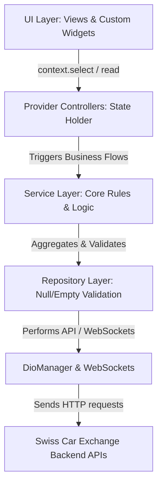
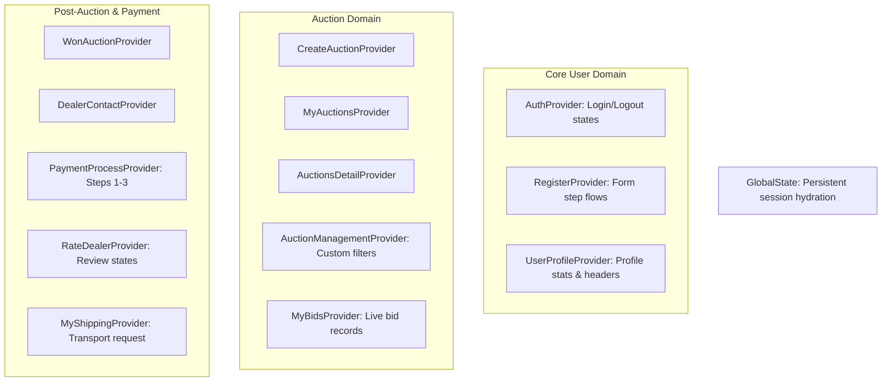

# Swiss Car Exchange (Rionydo) — Project Overview & Developer Guide


Welcome to the **Swiss Car Exchange (Rionydo)** developer onboarding and system overview guide. This application is a high-performance, premium digital car auction platform custom-tailored for both commercial companies and private buyers in Switzerland.

---

## 1. System Architecture

The project is built on **Clean Architecture** patterns, separating concerns strictly to keep the codebase testable, modular, and highly scalable.

### 🔄 Data & Business Logic Flow



### 🛑 Architectural Ground Rules

> [!IMPORTANT]
> - **No Layer Skipping**: The UI must *never* import a Repository or `DioManager`/`ApiClient` directly. All data must flow through Providers and Services.
> - **State Separation**: Providers hold user-facing state; Services hold the underlying business logic. Providers should remain thin and only manage visual updates.
> - **Null / Empty Data Rules**: Treat missing JSON keys, null values, empty strings `""`, or empty lists `[]` as *empty states* rather than network/server errors. All check validation must live in the **Repository** layer, not inside the UI or Providers.
> - **Serialization Boundaries**: JSON parsing is isolated entirely in typed models using `fromJson()` / `toJson()` factories (generated via Freezed / JsonSerializable).

---

## 2. Directory Structure Mapping

Below is the concrete breakdown of the `lib/` directory representing our scalable, feature-centric workspace:

```
lib/
├── main.dart                      # Core app entrypoint (lock orientation, load .env, MultiProvider, rehydrate states)
├── app.dart                       # Root MaterialApp initialization (custom dark theme, ScreenUtilInit setup)
├── app_router.dart                # Centralized GoRouter navigator keys, path configurations, & shell mapping
├── firebase_options.dart          # Configuration mapping for Firebase features
│
├── app_helper/                    # Application utility functions and shared files
│
├── app_utils/                     # Shared system configuration and base structures
│   ├── constants/                 # Centralized colors, typography, strings, assets, global states
│   └── network/                   # ApiClient, DioManager, error interceptors, exceptions, error handlers
│
├── controllers/                   # ChangeNotifier Providers managing state for feature domains
│   ├── auctions/                  # Auctions detail, creation, listing, bids, and dealer contacts
│   ├── auth/                      # Authentication status, session logs, and sign-up states
│   └── profile/                   # User statistics, payment settings, bank details, shipping requests
│
├── models/                        # Typed data transfer objects (DTOs) with JSON serialization rules
│   ├── auth/                      # User authentication, registration response data models
│   ├── auctions/                  # Auction lists, bidding history, statistics, and detail parameters
│   └── bid/                       # Bid response structures and WebSocket status models
│
├── services/                      # App-wide long-running services (WebSockets, Firebase notification channels)
│
├── views/                         # Modular Screen & Component layers organized by functional categories
│   ├── splash/                    # Launch, state check, and initialization screen
│   ├── auth/                      # Login, password reset checklist, step-by-step sign-up registration
│   ├── main_navigation/           # Persistent bottom shell routing container
│   ├── home/                      # Dashboard cards, live totals, feed views
│   ├── auctions/                  # Car previews, details, bidding interfaces
│   ├── bidding/                   # Online/Offline payment choices, stripe gateways
│   ├── profile/                   # Dashboards, transaction details, ratings
│   ├── won_auction/               # Post-auction transaction steps, dealer logs, shipping requests
│   └── premium/                   # Analytics panels, auction creation forms, statistics dashboards
│
└── widgets/                       # Core shared visual components (Shimmers, custom dialogs, app banners)
```

---

## 3. Technology Stack Reference

Our app relies on a premium, highly responsive suite of packages for optimal operation:

| Package | Purpose | Configuration Details |
| :--- | :--- | :--- |
| **`flutter_screenutil`** | Absolute responsiveness | Design scale dimensions set to `Size(402, 851)` (derived from Figma prototypes). |
| **`provider`** | State management | Lazy-loaded multi-providers declared dynamically in `main.dart`. |
| **`go_router`** | Routing & Navigation | Integrates indexed branches, stateful shell layouts, and secure key guards. |
| **`dio`** | HTTP requests | Managed via `DioManager` with support for OAuth, logging, and retry logic. |
| **`web_socket_channel`** | Real-time auctions | Connects active bidding screens directly to live market feeds. |
| **`flutter_secure_storage`** | Sensitive data | Holds encrypted authorization tokens and security credentials. |
| **`chewie` & `video_player`** | Media streaming | Custom play buttons overlaying cached video thumbnails dynamically. |
| **`webview_flutter`** | Payment flows | Renders Stripe Checkout pages directly in safe sandbox windows. |

---

## 4. State Management (MultiProvider Map)

All providers are initialized globally inside `MultiProvider` at `main.dart` to support seamless cross-screen updates and deep linkages:



---

## 5. Screen Navigation & Router Map

The application implements a secure, IndexedStack-based navigation shell through `app_router.dart`:

```
/splash                           [SplashScreen] (Launch point)
  ├── /onboarding                 [Step1Onboarding]
  │     ├── step2                 [Step2Onboarding]
  │     └── step3                 [Step3Onboarding]
  │
  ├── /login                      [LoginViews] (Regular email password entrance)
  ├── /signup                     [SignUpView]
  │     └── step2                 [SignUpStep2] (Credentials input & checklist)
  │           └── step3           [SignUpStep3] (Address details & document attachments)
  │
  ├── /verify-otp                 [OtpVerifyView] (Authentication verification)
  ├── /forgot-password            [ForgotPassView]
  │     ├── reset                 [ResetPasswordView]
  │     └── success               [SuccessfulView] (OTP navigation check status)
  │
  ├── /subscription               [SubscriptionView] (Tier choice page)
  ├── /before-subscription        [BeforeSubsView]
  ├── /checkout                   [CheckoutWebView] (Embedded Stripe WebView)
  │
  ├── [StatefulShellRoute]        [MainNavigationShell] (Bottom Nav Tabs)
  │     ├── /home                 [HomeView] (Feeds, Quick Stats)
  │     ├── /auctions             [AuctionsView] (Search filters, lists)
  │     ├── /bids                 [BidsView] (Participating logs)
  │     └── /profile              [ProfileView] (Seller dashboards)
  │
  ├── /auction-details            [AuctionDetails] (Live countdowns & car specs)
  ├── /auction-bidding            [AuctionBidding] (Active WebSockets bidding pane)
  ├── /payment/:auctionId         [PaymentProcessView] (Shipping, offline/online selection)
  ├── /rate-dealer/:auctionId     [RateDealerView] (Dealer reviews, star ratings)
  ├── /transaction-completed      [TransactionCompletedView]
  ├── /advanced-statistics        [AdvanceStatistics] (Premium analytical panels)
  ├── /create-auction             [CreateAuction] (Full screen form overlay)
  ├── /auction-management         [AuctionManagement] (Seller's active auctions)
  ├── /update-subscription        [SubscriptionViews] (Tier choice page)
  ├── /account-settings           [AccountSettingsView]
  ├── /manage-subscription        [AccountSubscriptionView] (Tier cancel & upgrade)
  └── /privacy-settings           [PrivacySettingsView]
```

---

## 6. Core Development Standards & Features

### 📶 1. Offline Connectivity Handling
We enforce a robust offline-first system to preserve reliable user experience during commute or poor connectivity:
- The app monitors connection states dynamically via `ConnectivityService`.
- If a connection drops, a **persistent top-level banner** is shown. The user cannot dismiss it manually until active internet is restored.
- All repositories check connectivity *before* launching Dio requests, throwing a `NoInternetException` instantly if offline, preventing blank screen lockouts.
- The system automatically triggers a retry of the last failed operations upon reconnection.

### 🔒 2. Password Strength Checklists
The sign-up password checklist uses real-time validation to evaluate parameters on every keypress:
1. **Length Check**: A minimum of 8 characters.
2. **Case Verification**: Contains at least one uppercase and one lowercase character.
3. **Numeric Check**: Contains at least one digit.

*Implementation Mechanism:*
- A listener is attached to `passwordController` inside `initState` of `SignUpView`.
- Individual computed getters determine validator rule values.
- Reusable `_PasswordRule` checklist widgets visually change colors (using `AppColors.sceTeal` for success and `AppColors.sceGreyA0` for pending states) in real-time.

```dart
bool get _hasMinLength => passwordController.text.length >= 8;
bool get _hasUppercase => passwordController.text.contains(RegExp(r'[A-Z]'));
bool get _hasLowercase => passwordController.text.contains(RegExp(r'[a-z]'));
bool get _hasNumber    => passwordController.text.contains(RegExp(r'[0-9]'));
```

### 🚫 3. Self-Bidding Restrictions
To guarantee auction integrity and prevent shill bidding, users are strictly forbidden from placing bids on their own car listings:
- **Ownership Flag Check**: The bidding systems read `isOwner` properties within `AuctionDetailResponse` dynamically.
- **UI Transformations**:
  - If a user is the owner, `AuctionDetails` displays a **"Live Bids"** indicator instead of the standard **"OFFER NOW"** call to action.
  - If they attempt to access bidding pipelines directly, the system shows an `AppSnackBar` warning and blocks subsequent input fields.

```dart
if (detailData?.isOwner == true) {
  // Render owner-specific widgets
  return LiveBidsHeader();
} else {
  // Render bidding buttons for third-party bidders
  return OfferNowButton();
}
```

### 📺 4. Centered Video Media Player
Our auction cards feature optimized video widgets powered by `video_player` and `chewie`:
- Pre-computed aspect ratios prevent page layout shifts while loading media buffers.
- Video playback buttons are centered precisely over visual overlay previews to look premium.
- Clean controllers are fully disposed of inside the `dispose` block of widgets to prevent memory leaks in memory-intensive scroll feeds.

---

## 7. Performance & Quality Standards

To maintain smooth, premium dark-teal themed layouts:

- **Limit Widget Rebuilds**: Always use `context.select<T, R>()` over `context.watch<T>()` in views to rebuild only when specific parameters of a provider change, not the entire controller state.
- **Dispose Controllers**: `TextEditingController`, `ScrollController`, and `AnimationController` instances *must* be closed inside `dispose()` methods.
- **Const Constructors**: Maximize the usage of `const` builders to allow Flutter to reuse element frameworks efficiently.
- **Clean Sizing Boundaries**: Every static dimensions, vertical padding, and font sizes *must* be suffixed with ScreenUtil indicators (`.w`, `.h`, `.sp`, `.r`). Do not hardcode raw values!
- **Strict File Limits**: Files must never exceed **200 lines**. If a widget or class grows beyond this, extract sub-widgets into separate focused helper components or split business layers.

---

&copy; 2026 Swiss Car Exchange (Rionydo). Developed using premium Flutter architecture guidelines.
